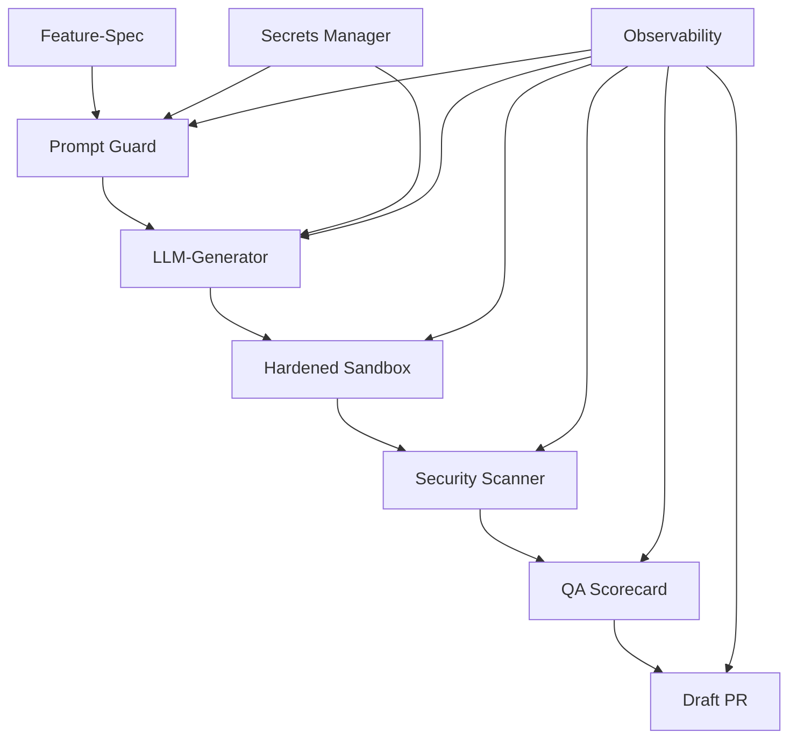

# CodePipeline Onboarding Guide

**Version**: 1.0  
**Letzte Aktualisierung**: 2025-01-17  
**Zielgruppe**: Neue Team-Mitglieder, Entwickler, DevOps-Engineers

## 👋 Willkommen bei CodePipeline

CodePipeline ist ein vollständig automatisiertes System für sichere, reproduzierbare Feature-Entwicklung mit LLM-Unterstützung. Dieses Onboarding führt Sie durch alle notwendigen Schritte für den produktiven Einsatz.

### Was Sie lernen werden

- ✅ System-Architektur und Komponenten
- ✅ Entwicklungsumgebung einrichten
- ✅ Erste Feature-Spec erstellen
- ✅ Pipeline-Workflow verstehen
- ✅ Security- und Compliance-Anforderungen
- ✅ Troubleshooting und Best Practices

**Geschätzte Dauer**: 2-3 Stunden

---

## 🛠️ Entwicklungsumgebung einrichten

### Voraussetzungen

**System-Anforderungen:**
- Python 3.10 oder höher
- Git 2.30+
- 8GB RAM (empfohlen)
- 5GB freier Speicherplatz

**Accounts benötigt:**
- GitHub-Account mit Repository-Zugriff
- OpenAI-API-Key (oder anderer LLM-Provider)
- Vault/OIDC-Zugang (falls verwendet)

### Installation

1. **Repository klonen:**
   ```bash
   git clone https://github.com/company/codepipeline.git
   cd codepipeline
   ```

2. **Python-Environment einrichten:**
   ```bash
   # Virtual Environment erstellen
   python -m venv venv
   
   # Aktivieren (Linux/Mac)
   source venv/bin/activate
   
   # Aktivieren (Windows)
   venv\Scripts\activate
   ```

3. **Dependencies installieren:**
   ```bash
   pip install -r requirements.txt
   ```

4. **System-Verifikation:**
   ```bash
   # Basis-Check
   python --version
   python -c "import codepipeline; print('✅ Import erfolgreich')"
   
   # CLI-Test
   python -m codepipeline.cli spec validate examples/sample-spec.json
   ```

### Secrets konfigurieren

**Environment-Setup:**
```bash
# .env-Datei erstellen (NICHT in Git committen!)
cat > .env << 'EOF'
# LLM-API-Keys
SECRET_OPENAI_API_KEY="sk-your-openai-key-here"

# GitHub-Integration
SECRET_GITHUB_TOKEN="ghp_your-github-token-here"

# Optional: Vault-Integration
VAULT_ADDR="https://vault.company.com"
VAULT_TOKEN="s.your-vault-token"
EOF

# Environment laden
source .env
```

**Secret-Validation:**
```bash
python -c "
from hardened_secrets_flow import validate_secrets_early
try:
    validate_secrets_early('openai_api_key', 'github_token')
    print('✅ Alle Secrets verfügbar')
except Exception as e:
    print(f'❌ Secret-Problem: {e}')
"
```

---

## 📚 System-Architektur verstehen

### Kernkomponenten-Übersicht



**Datenfluss:**
1. **Feature-Spec** definiert Anforderungen und Constraints
2. **Prompt Guard** validiert und sanitized LLM-Inputs
3. **LLM-Generator** erstellt Code-Changes als Unified Diff
4. **Hardened Sandbox** wendet Changes sicher an
5. **Security Scanner** prüft auf Vulnerabilities
6. **QA Scorecard** bewertet Gesamtqualität
7. **Draft PR** wird bei Erfolg erstellt

### Sicherheitsmodell

**Fail-Closed-Prinzip:**
- Alle Gates müssen explizit bestehen
- Bei Unsicherheit wird abgebrochen
- Umfassende Audit-Trails

**Isolation-Layer:**
- Sandboxed-Execution für Code-Changes
- Secret-Isolation ohne Leakage
- Path-Restrictions für File-Access

**Observability:**
- Vollständige Run-Nachverfolgbarkeit
- Strukturierte Metriken und Logs
- Export für Compliance-Audits

---

## 🎯 Erste Schritte - Hands-On Tutorial

### Schritt 1: Sample-Feature verstehen

Schauen Sie sich die Beispiel-Spec an:
```bash
cat examples/sample-spec.json
```

**Wichtige Felder erklärt:**
```json
{
  "id": "SAMPLE-001",                    // Eindeutige Feature-ID
  "risk_level": "low",                   // Bestimmt Security-Anforderungen
  "target_paths": ["src/", "tests/"],    // Nur diese Pfade dürfen geändert werden
  "token_budget": 5000,                  // Maximum LLM-Token
  "hard_musts": ["coverage_threshold"]   // Pflicht-Gates
}
```

### Schritt 2: Dry-Run ausführen

```bash
# Ersten Test-Run starten (ohne echte Änderungen)
python -m codepipeline.cli feature \
  --spec examples/sample-spec.json \
  --branch tutorial/first-run \
  --dry-run

# Ergebnis prüfen
echo "Exit code: $?"
ls -la pipeline_artifacts/
```

**Erwartetes Ergebnis:**
- Exit-Code 0 (Success) oder spezifischer Fehler-Code
- Artifacts in `pipeline_artifacts/`
- Strukturierte Logs ohne Secret-Werte

### Schritt 3: Artifacts analysieren

```bash
# QA-Scorecard ansehen
cat pipeline_artifacts/qa_scorecard.json | jq '.scorecard'

# Pipeline-Timing
cat pipeline_artifacts/pipeline_result.json | jq '.executions[] | {stage, duration, result}'

# Security-Report (falls vorhanden)
cat pipeline_artifacts/bandit_report.json | jq '.results | length'
```

### Schritt 4: Eigene Feature-Spec erstellen

Erstellen Sie Ihre erste Feature-Spec:
```bash
cat > my-first-feature.json << 'EOF'
{
  "id": "TUTORIAL-001",
  "title": "My First Feature",
  "version": 1,
  "goal": "Add a simple hello world function to demonstrate the pipeline",
  "target_paths": ["src/tutorial/"],
  "constraints": ["simple implementation", "include tests"],
  "risk_level": "low",
  "reviewers": ["tutorial-reviewer"],
  "model": "gpt-4o-mini",
  "token_budget": 2000,
  "tests": {
    "coverage_min": 70,
    "pytest_args": ["-v"]
  },
  "hard_musts": ["coverage_threshold"]
}
EOF

# Spec validieren
python -m codepipeline.cli spec validate my-first-feature.json
```

### Schritt 5: Tutorial-Feature ausführen

```bash
# Ziel-Verzeichnis erstellen
mkdir -p src/tutorial/

# Feature-Development starten
python -m codepipeline.cli feature \
  --spec my-first-feature.json \
  --branch tutorial/my-feature \
  --dry-run

# Ergebnisse analysieren
cat pipeline_artifacts/qa_scorecard.md
```

---

## 🔒 Security und Compliance

### Security-Best-Practices

**Secret-Management:**
```bash
# ✅ Richtig: Environment-Variable mit PREFIX
export SECRET_API_KEY="sk-..."

# ❌ Falsch: Direkt in Code
api_key = "sk-hardcoded-key"

# ✅ Richtig: Sichere Verwendung
from hardened_secrets_flow import get_secret
api_key = get_secret("api_key", SecretSeverity.CRITICAL)
```

**Path-Security:**
```json
{
  "target_paths": [
    "src/feature/",         // ✅ Richtig: Relative Pfade
    "tests/feature/"
  ],
  "constraints": [
    "no system files",      // ✅ Richtig: Explizite Constraints
    "relative paths only"
  ]
}
```

**Audit-Compliance:**
- Alle Runs werden vollständig geloggt
- Secret-Zugriffe ohne Werte-Exposition
- Reproduzierbare Builds mit Manifesten
- SBOM-Generierung für Supply-Chain-Security

### Compliance-Checkliste

Vor Production-Deployment:
- [ ] Secrets über Vault/OIDC (nicht ENV)
- [ ] High-Risk-Features haben 2+ Reviewer
- [ ] Security-Threshold auf "high" gesetzt
- [ ] Coverage-Threshold ≥ 85%
- [ ] SBOM-Generierung aktiviert
- [ ] Audit-Trail-Export konfiguriert

---

## 🚀 Pipeline-Workflow verstehen

### Standard-Pipeline-Stufen

1. **Setup** (🔧)
   - System-Checks
   - Dependency-Validation
   - Git-Status

2. **Lint/Type** (🔍)
   - Ruff-Linting
   - MyPy Type-Checking
   - Code-Quality-Metriken

3. **Tests/Coverage** (🧪)
   - Pytest-Ausführung
   - Coverage-Measurement
   - Threshold-Validation

4. **Security/SBOM** (🛡️)
   - Bandit-Security-Scan
   - Dependency-Vulnerability-Check
   - SBOM-Generierung

5. **Scorecard** (📊)
   - Aggregierte Quality-Bewertung
   - Hard-Must-Validation
   - Pass/Fail-Entscheidung

6. **Draft-PR** (🔄)
   - GitHub-PR-Erstellung
   - Artifact-Linking
   - Review-Assignment

### Pipeline-Konfiguration

```python
# Beispiel: Custom Pipeline-Config
from unified_cicd_pipeline import PipelineConfig

config = PipelineConfig(
    min_coverage_threshold=85.0,
    max_linting_violations=5,
    security_severity_threshold="high",
    fail_fast=True,
    create_pr=True
)
```

### Monitoring und Debugging

**Pipeline-Status prüfen:**
```bash
# Aktuelle Pipeline-Metriken
python -c "
from audit_trail_observability import ObservabilityManager
mgr = ObservabilityManager('STATUS-CHECK', 'audit_trail.db')
stats = mgr.get_run_statistics()
print(f'Success rate: {stats[\"status_distribution\"]}')
"

# Performance-Analyse
cat pipeline_artifacts/pipeline_result.json | jq '.total_duration'
```

**Häufige Issues debuggen:**
```bash
# Linting-Issues
python -m ruff check --diff .

# Coverage-Issues  
python -m pytest --cov=. --cov-report=term-missing

# Security-Issues
python -m bandit -r . -ll
```

---

## 🎓 Advanced Topics

### Custom-Templates entwickeln

```python
from reproducibility_supply_chain import PromptTemplate

custom_template = PromptTemplate(
    template_id="custom_feature",
    version="1.0",
    content="""Create {feature_type} for {domain}:

Requirements:
{requirements}

Constraints:
{constraints}

Output as unified diff format.""",
    variables=["feature_type", "domain", "requirements", "constraints"],
    deterministic_seed=12345
)
```

### Observability-Integration

```python
from audit_trail_observability import ObservabilityManager

# Custom-Metriken erfassen
observability = ObservabilityManager("CUSTOM-FEATURE", "audit.db")

with observability.run_context("feature_hash") as run_id:
    observability.record_metric("custom_metric", "counter", 1)
    observability.log_structured("info", "Custom event", extra_data={"key": "value"})
```

### Multi-Environment-Setup

```yaml
# environments/dev.yml
coverage_threshold: 70.0
security_threshold: "medium"
create_pr: false

# environments/prod.yml  
coverage_threshold: 90.0
security_threshold: "high"
create_pr: true
hard_musts: ["security_scan", "coverage_threshold", "license_compliance"]
```

---

## ✅ Onboarding-Checkliste

### Woche 1 - Grundlagen
- [ ] Entwicklungsumgebung eingerichtet
- [ ] Secrets konfiguriert und getestet
- [ ] Sample-Feature erfolgreich ausgeführt
- [ ] Erste eigene Feature-Spec erstellt
- [ ] Pipeline-Artifacts analysiert

### Woche 2 - Vertiefung
- [ ] Security-Best-Practices verstanden
- [ ] Compliance-Anforderungen bekannt
- [ ] Troubleshooting-Skills entwickelt
- [ ] Advanced-Features erkundet
- [ ] Team-Workflows integriert

### Woche 3 - Produktiv
- [ ] Erstes Production-Feature deployed
- [ ] Monitoring-Dashboards konfiguriert
- [ ] Incident-Response-Training absolviert
- [ ] Documentation-Contributions
- [ ] Onboarding-Feedback gegeben

---

## 🤝 Team-Integration

### Communication-Channels

**Slack-Channels:**
- `#codepipeline-general`: Allgemeine Diskussionen
- `#codepipeline-alerts`: Automated-Alerts
- `#codepipeline-incidents`: Incident-Response

**Meetings:**
- **Daily Standup**: Pipeline-Status und Blockers
- **Weekly Review**: Metrics und Improvements
- **Monthly Retrospective**: Process-Optimierungen

### Code-Review-Process

1. **Feature-Spec-Review**: Vor Pipeline-Ausführung
2. **Generated-Code-Review**: Nach LLM-Generation
3. **Security-Review**: Bei High-Risk-Features
4. **Final-Approval**: Vor PR-Merge

### Contribution-Guidelines

```bash
# Branch-Naming
feature/SPEC-ID-short-description
hotfix/issue-number-description

# Commit-Messages
feat(SPEC-001): add user authentication system
fix(pipeline): resolve coverage calculation bug
docs(onboarding): update secret configuration steps
```

---

## 📞 Support und Hilfe

### Selbsthilfe-Ressourcen

1. **[Runbook](RUNBOOK.md)**: Operative Prozeduren
2. **[Incident-Playbook](INCIDENT_PLAYBOOK.md)**: Troubleshooting
3. **[FAQ](FAQ.md)**: Häufige Fragen
4. **[Architecture-Docs](../docs/adr/)**: System-Design

### Support-Kontakte

**Onboarding-Buddy**: Ihr zugewiesener Mentor  
**Team-Lead**: tech-lead@company.com  
**DevOps-Team**: devops@company.com  

### Feedback und Verbesserungen

Ihr Feedback ist wichtig! Bitte teilen Sie mit:
- Was war besonders hilfreich?
- Welche Schritte waren unklar?
- Welche Tools/Docs fehlen?
- Verbesserungsvorschläge?

**Feedback-Form**: https://forms.company.com/codepipeline-onboarding

---

## 🎉 Herzlichen Glückwunsch!

Sie haben das CodePipeline-Onboarding erfolgreich abgeschlossen! Sie sind jetzt bereit für:

- ✅ Sichere Feature-Entwicklung mit LLM-Unterstützung
- ✅ Compliance-konforme Workflows
- ✅ Effektive Troubleshooting-Fähigkeiten
- ✅ Team-Collaboration und Best-Practices

**Nächste Schritte:**
1. Erstes Production-Feature planen
2. Team-Workflows kennenlernen
3. Advanced-Features erkunden
4. Anderen beim Onboarding helfen

**Willkommen im CodePipeline-Team! 🚀**

---

**📝 Guide-Version:** 1.0  
**🔄 Nächste Review:** 2025-04-17  
**✍️ Autor:** CodePipeline-Team
